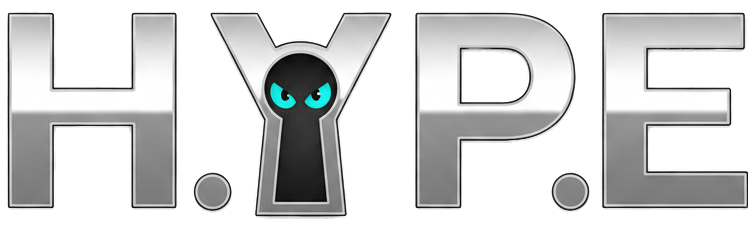
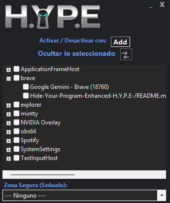
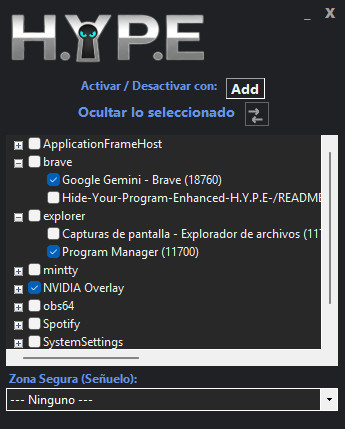
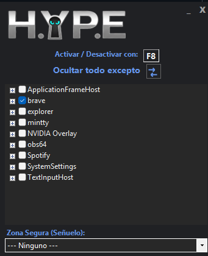
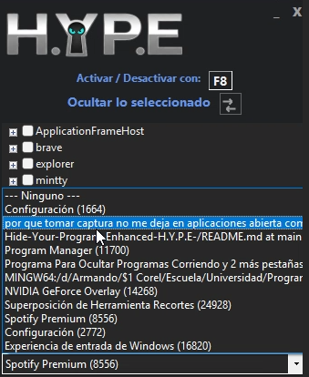

    

# `>_` H.Y.P.E. (Hide Your Program: Enhanced)

**La Herramienta Definitiva de "Botón de Pánico" para Windows. Sigilo Visual y Auditivo Instantáneo.**

 

| 👻 | **Nueva Versión v2.1:** | *Ahora con "Modo Inverso", Herencia de Procesos y Sistema de Recuperación ante Fallos.*   ¡Descarga el ejecutable abajo! |
|--|-------------|:---------------------------------------------------------------------------------------------------------------------------------------------------------------|

 

    

---

    
Desplegar Tabla de Contenidos

    
 
        
- [Propósito](#-propósito)
- [Capturas de Pantalla](#-capturas-de-pantalla)
- [Descarga](#-descarga)
- [Características](#-características)
- [Arquitectura](#-arquitectura)
- [Instalación](#-instalación)
- [Contribuciones](#-contribuciones)
- [Créditos](#-créditos)

---

## `>_` Propósito

**H.Y.P.E.** no es un simple "minimizador" de ventanas. Es un sistema de privacidad avanzado diseñado para ocultar actividades al instante sin dejar rastro. Utiliza la API nativa de Windows y ganchos de audio de bajo nivel para garantizar que, cuando presiones el botón de pánico, la aplicación objetivo desaparezca **visual y auditivamente**.

**Casos de Uso Principales:**
- **Privacidad Instantánea:** Oculta juegos, chats o ventanas sensibles con una sola tecla.
- **Entornos Compartidos:** Evita miradas indiscretas en la oficina o el hogar.
- **Gestión de Audio:** Silencia automáticamente aplicaciones ruidosas al ocultarlas, algo que el botón "Minimizar" de Windows no hace.

> [!Caution]
> **Permisos de Administrador:**  
> Para que H.Y.P.E. pueda interactuar con procesos elevados (como Juegos en modo Admin o Administradores de Tareas) y controlar el mezclador de audio global, **debe ejecutarse siempre como Administrador**.

---

## `>_` 🎥 Demos en Vivo

¡Mira H.Y.P.E. en acción!

  <table>
    <tr>
      <td align="center">
        <strong>⚡ Pánico Instantáneo</strong> 
        <em>Oculta ventanas y silencia audio en milisegundos.</em>  
        
      </td>
      <td align="center">
        <strong>🎭 Sistema de Señuelo</strong> 
        <em>Abre automáticamente una app segura (ej. Excel).</em>  
        
      </td>
    </tr>
  </table>

---

## `>_` 📱 Galería de Pantallas

Interfaz moderna "Dark Mode" diseñada para ser discreta y eficiente:

     
    <table>
        <tr>
            <td align="center" width="50%">
                <strong>Dashboard Principal</strong> 
                
            </td>
            <td align="center" width="50%">
                <strong>Selección de Procesos</strong> 
                
            </td>
        </tr>
        <tr>
            <td align="center" width="50%">
                <strong>Modo: Ocultar Todo Excepto</strong> 
                
            </td>
            <td align="center" width="50%">
                <strong>Configuración de Señuelo</strong> 
                
            </td>
        </tr>
    </table>
     

---

## `>_` ⬇️ Descarga

Descarga el ejecutable portable `Hype.exe` directamente desde Releases:

  <a href="https://github.com/DeathSilencer/Hide-Your-Program-Enhanced-H.Y.P.E-/releases/latest">
    
  </a>

---

## `>_` Características

- **Global Hotkey Hook:** Presiona `F8` (o tu tecla personalizada) en cualquier momento para activar el pánico, incluso dentro de juegos a pantalla completa.
- **Smart Audio Muting:** Utiliza la librería `NAudio` para detectar el PID del proceso y silenciar su sesión de audio específica en el mezclador de Windows.
- **Modo "Señuelo" (Decoy):** Configura una aplicación segura (ej. Word, Excel, Desktop) que H.Y.P.E. traerá al frente automáticamente al ocultar tus ventanas.
- **Dual Modes:**
    - *Modo Normal:* Oculta solo lo que seleccionas.
    - *Modo Inverso:* Oculta **TODO** lo que hay en pantalla excepto tu lista blanca.
- **Herencia de Procesos:** Si marcas un programa (ej. `Steam`), H.Y.P.E. detectará automáticamente las ventanas hijas o launchers que ese programa abra después.
- **Crash Recovery:** Sistema de seguridad que guarda el estado de las ventanas ocultas en `HypeState.dat`. Si se va la luz, H.Y.P.E. restaura tus ventanas al reiniciar.
- **Stealth:** Se oculta de la barra de tareas y del System Tray cuando está activo.

---

## `>_` Arquitectura

El proyecto utiliza una arquitectura limpia separando la lógica de la interfaz (UI):

| Componente | Tecnología | Descripción |
| :--- | :--- | :--- |
| **Core UI** | WinForms .NET | Interfaz gráfica moderna sin bordes (Borderless Form). |
| **Win32 Helper** | P/Invoke (User32/Kernel32) | Manipulación de ventanas, ToolHelp32Snapshot y Hotkeys. |
| **Audio Engine** | NAudio CoreAudioApi | Gestión de sesiones de audio WASAPI por proceso. |
| **Input** | NativeWindow Hook | Intercepción de mensajes `WM_HOTKEY` a nivel de sistema. |
| **Packaging** | Costura.Fody | Compilación de DLLs dentro del EXE para portabilidad total. |

---

## `>_` Instalación

1.  Descarga `Hype.exe`.
2.  Colócalo en cualquier carpeta (es portable).
3.  Haz clic derecho -> **Ejecutar como Administrador**.
4.  Marca las casillas de los programas que quieres controlar.
5.  ¡Presiona **F8** y desaparece!

---

## `>_` ❓ Solución de Problemas (FAQ)

**P: ¿Por qué necesito ejecutarlo como Administrador?**
> **R:** Para poder ocultar ventanas de otros programas que también corren como administrador (ej. Juegos con Anti-Cheat, Task Manager) y para tener acceso al control de volumen global.

**P: El programa se cerró inesperadamente, ¿perdí mis ventanas ocultas?**
> **R:** **No.** H.Y.P.E. tiene un sistema de recuperación. Simplemente vuelve a abrir el programa y detectará el archivo de recuperación, restaurando la visibilidad de tus ventanas automáticamente.

**P: Me sale un error "No se pudo registrar la tecla global".**
> **R:** Significa que otro programa está usando la tecla `F8`. H.Y.P.E. intenta matar instancias zombies de sí mismo al iniciar, pero si el problema persiste, intenta cerrar otros programas o reiniciar.

---

## `>_` Contribuciones

¡Las contribuciones son bienvenidas!

1. **Fork del Repo**: Haz tu propia copia.
2. **Crea una Rama**: `git checkout -b feature/NuevaFuncion`.
3. **Commit**: `git commit -m 'Add: Nueva función increíble'`.
4. **Push**: `git push origin feature/NuevaFuncion`.
5. **Pull Request**: Envía tu PR para revisión.

---

## `>_` 🙌 Créditos y Desarrollador

- 👨‍💻 Desarrollado por **David Platas**
- 🔊 Potenciado por **NAudio**.
- 📦 Empaquetado con **Costura.Fody**.

  <a href="https://github.com/DeathSilencer">
    
  </a>

 

### `>_` ⚖️ Aviso Legal (Disclaimer)

> [!Warning]
> **Uso Responsable:**  
> H.Y.P.E. es una herramienta de privacidad. El desarrollador no se hace responsable del uso indebido de este software para ocultar actividades ilícitas o violar políticas de uso en entornos corporativos o educativos.
